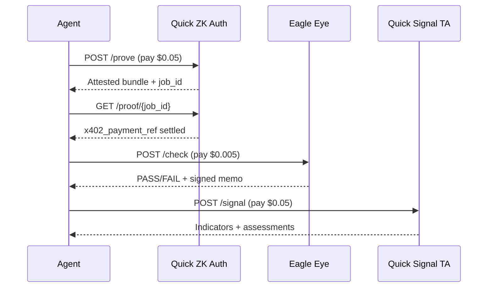

# Composing the stack

The three Quick AI services answer different questions. Together they form a practical pipeline for **agentic commerce** on Base.

## Question each service answers

| Order | Service | Question |
|-------|---------|----------|
| 1 | **Quick ZK Auth** | Does this wallet control funds and meet a USDC bar? |
| 2 | **Eagle Eye** | Is this destination allowed under U.S. sanctions and USDC blacklist rules? |
| 3 | **Quick Signal TA** | What does the market technical picture look like for this asset? |

None of the three replaces the others. ZK Auth is not sanctions screening. Eagle Eye is not market analysis. Signal is not compliance or identity.

## Recommended flow

## When to use each step

### Step 1 — ZK Auth (optional but recommended for commerce)

Use when an agent or marketplace must show:

- Economic participation (minimum USDC)  
- Ownership without broadcasting the wallet in every log  
- ERC-8004 registry evidence (`?format=erc8004`)  

Skip when the workflow is read-only market data with no wallet gate.

### Step 2 — Eagle Eye (required for regulated U.S. flows)

Use before:

- Sending USDC to a new counterparty  
- Executing a trade route through multiple hop addresses  
- Onboarding a treasury destination  

Use **`/check`** for a single address. Use **`/check/batch`** for up to 100 ordered hops. Use **`/check/profile`** when activity history informs risk.

### Step 3 — Signal (market context)

Use when the agent needs:

- Indicator-backed narrative (not just price)  
- Timeframe-specific TA (`1d`, `4h`, etc.)  
- A Bazaar-schema response other agents can parse  

Run after compliance passes if the action is trade-related.

## Cost budget (example)

| Step | Call | Cost |
|------|------|------|
| Qualify wallet | `POST /prove` | $0.05 |
| Screen counterparty | `POST /check` | $0.005 |
| TA on asset | `POST /signal` | $0.05 |
| **Total** | | **~$0.105 USDC** |

Batch Eagle checks scale linearly at $0.005 per address (capped at $0.50 per request).

## Evidence chain for registries

For ERC-8004 or audit trails, retain:

1. ZK Auth bundle with `x402_payment_ref.tx_hash` (poll `GET /proof/{job_id}`)  
2. Eagle Eye response with `audit_signature` and `snapshot_timestamp`  
3. Signal `SignalResponse` with `timestamp` and `data_source`  

Each artifact is independently paid and independently verifiable (ZK on-chain verify coming in v1.1).

## Anti-patterns

| Do not | Because |
|--------|---------|
| Use Signal as OFAC screening | No sanctions data |
| Use Eagle as proof of wallet ownership | Different trust model |
| Claim ZK Auth hides balance in v1.0.1 | Balance is `rpc_attestation` |
| Rely on GET /signal without `token` | Returns 400 after payment |
| Skip Redis on ZK Auth production | Payment binding and replay break |

## Listing on agentic.market

Suggested marketplace copy per service:

- **Eagle Eye:** U.S. enterprise wallet compliance — OFAC + USDC blacklist, signed receipts  
- **Quick Signal TA:** Ten-indicator crypto TA with natural-language assessments  
- **Quick ZK Auth:** Semaphore ownership + USDC qualification for ERC-8004 agents  

Link each listing to the service page in this documentation and to the shared [x402 & Bazaar](./x402-bazaar.md) page.