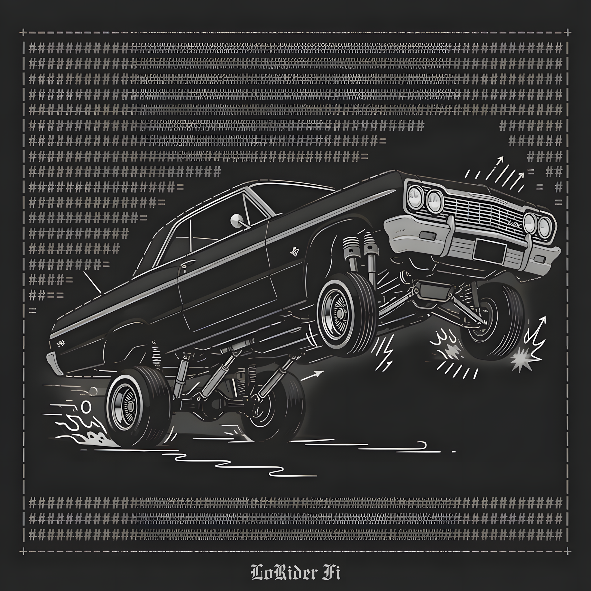

# Catalog

Full discography for **Nick Quick**. All releases available on major streaming platforms.

## Albums

| # | Album | Year | Tracks |
|---|-------|------|--------|
| 1 | **Neon Compiler** | 2026 | 15 |
| 2 | **Through the Static Curtain** | 2026 | 15 |
| 3 | **Escalator Mirage** | 2026 | 15 |
| 4 | **Synthetik System Drive** | 2026 | 15 |
| 5 | **LoRider Fi** | 2026 | 15 |
| 6 | **HexGrid Phonk** | 2026 | 10 |
| 7 | **VGDM: 8-bit** | 2026 | 12 |

**Total: 7 albums · 97 tracks**

## Album art

## Keeping this page current

New releases should be added here as they go live. This page is the single source of truth for agents and humans browsing the docs — keeping it updated means every discovery path stays accurate.
